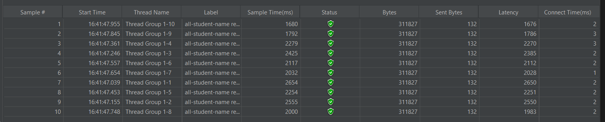

# Perfomance Testing Using JMeter

## Endpoint `/all-student`

### Using Command Line Result

### Before Optimization

### After Optimization

## Endpoint `/all-student-name`

### Using Command Line Result

### Before Optimization

### After Optimization

## Endpoint `/highest-gpa`

### Using Command Line Result

### Before Optimization

### After Optimization

